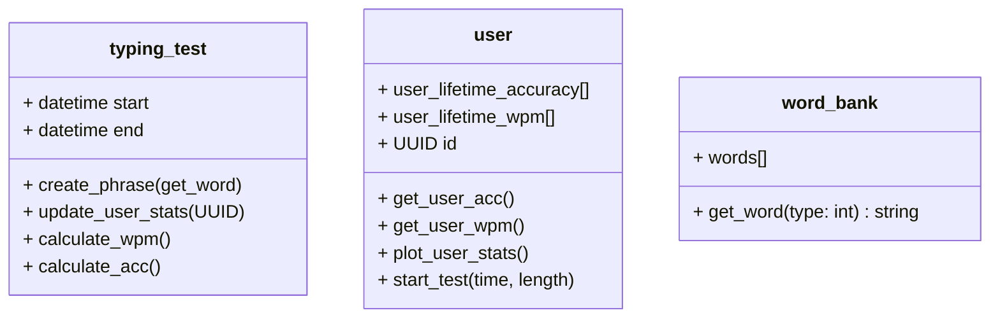

# tippitytappity-design

tippitytappity is a program to practice typing

## Data model

```mermaid
classDiagram
  class typing_test {
        + create_phrase(get_word)
        + datetime start
        + datetime end
        + update_user_stats(UUID)
        + calculate_wpm()
        + calculate_acc()
  }
  class user {
        + get_user_acc()
        + get_user_wpm()
        + user_lifetime_accuracy[]
        + user_lifetime_wpm[]
        + plot_user_stats()
        + UUID id
        + start_test(time, length)
  }
  class word_bank{
        + get_word(type: int) string
        + words[]
  }
```
